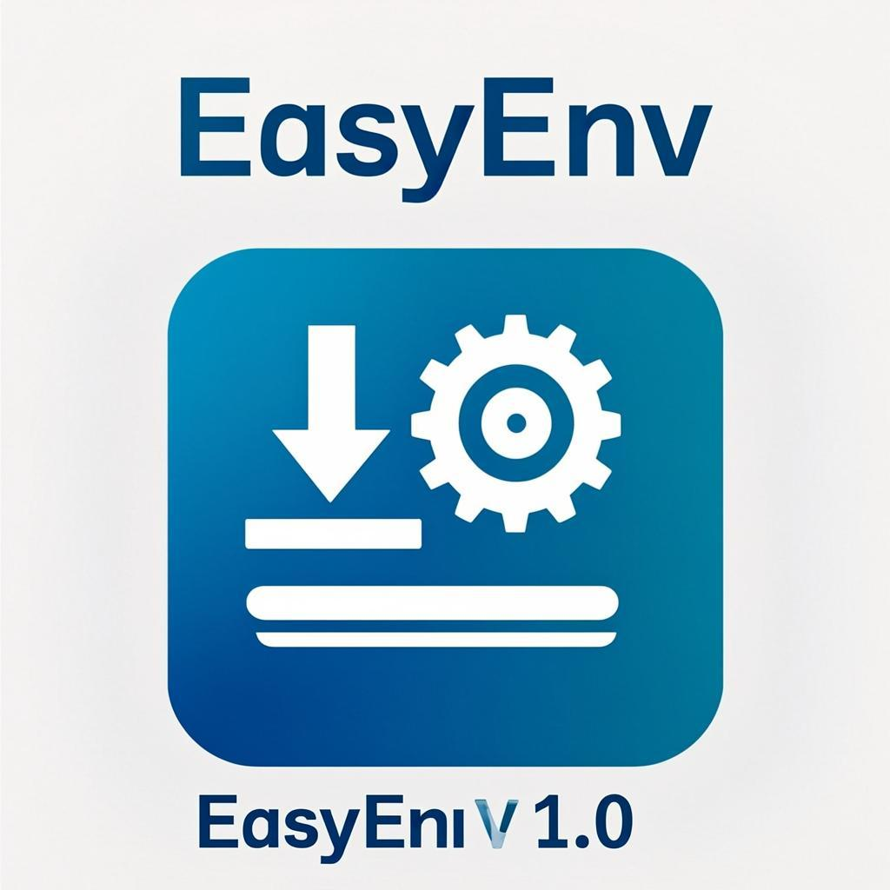

# EasyEnv - Windows开发环境一键部署工具

<div align="center">



**企业级 Windows 开发环境一键部署解决方案**

[](LICENSE)
[](https://www.python.org/)
[](https://www.microsoft.com/windows)
[](../../actions)

</div>

---

## 📖 简介

EasyEnv 是一款专为 Windows 平台设计的企业级开发环境部署工具。它解决了传统环境配置工具的痛点，提供动态版本获取、国内镜像加速、环境模板管理、安装回滚等专业功能。

### ✨ 核心特性

#### 🔄 动态版本管理
- **实时版本获取** - 从官方API动态获取最新版本，不再硬编码
- **LTS/安全更新标识** - 自动标记长期支持版本和安全补丁
- **版本缓存机制** - 6小时本地缓存，离线时使用回退版本

#### 🌐 镜像源支持
- **国内镜像加速** - 支持清华、中科大、阿里云、华为云等镜像
- **自动速度测试** - 智能选择最快的镜像源
- **代理配置** - 支持HTTP/HTTPS代理设置
- **自定义镜像源** - 可添加企业内部镜像源

#### ⚡ 高级下载功能
- **断点续传** - 网络中断后继续下载，不重复下载
- **多线程下载** - 大文件自动分片并行下载
- **自动重试** - 失败自动重试3次
- **文件校验** - 下载完成后自动校验文件完整性

#### 🔙 安装回滚机制
- **环境状态快照** - 安装前备份PATH和注册表
- **一键回滚** - 安装失败自动恢复到安装前状态
- **批量回滚** - 支持回滚所有失败的安装

#### 📋 环境模板
- **预设模板** - 前端/后端/全栈/Java/Go/Rust/数据科学等模板
- **配置导入/导出** - JSON/YAML格式，实现团队环境统一
- **自定义模板** - 从当前选择创建个人模板

#### 🔧 多版本管理
- **多版本共存** - 支持同时安装多个版本
- **版本切换** - 一键切换默认版本
- **安装方式检测** - 自动识别pyenv/nvm/rustup等版本管理器

#### 🗑️ 完整生命周期管理
- **一键卸载** - 支持卸载指定版本或全部版本
- **清理残留** - 自动清理注册表和PATH

---

## 🛠️ 支持的开发环境

| 环境 | 图标 | 多版本 | 国内镜像 | 版本管理工具集成 |
|------|------|--------|----------|------------------|
| Python | 🐍 | ✅ | ✅ | pyenv-win |
| Node.js | 💚 | ✅ | ✅ | nvm-windows |
| Git | 🔀 | ✅ | ✅ | - |
| VS Code | 💠 | - | - | - |
| OpenJDK | ☕ | ✅ | ✅ | - |
| Go | 🔵 | ✅ | ✅ | - |
| Rust | 🦀 | ✅ | ✅ | rustup |
| CMake | 📐 | ✅ | - | - |
| MinGW-w64 | ⚙️ | ✅ | - | - |
| Docker Desktop | 🐳 | - | - | - |

---

## 📥 下载安装

### 方式一：直接下载 exe 文件（推荐）

1. 前往 [Releases](../../releases) 页面
2. 下载最新的 `EasyEnv.exe`
3. **右键以管理员身份运行**（推荐）

### 方式二：从源码运行

```bash
# 克隆仓库
git clone https://github.com/LWJSTONE/EasyEnv.git
cd EasyEnv

# 安装依赖
pip install -r requirements.txt

# 运行开发版本
python main.py

# 运行测试
python -m pytest tests/ -v
```

### 方式三：自行构建

```bash
# Windows上执行
python scripts/build.py
# 或
scripts\build.bat
```

---

## 📋 使用指南

### 基本操作流程

```
1. 启动程序（建议以管理员身份运行）
      ↓
2. 选择环境模板 或 手动选择环境
      ↓
3. 选择版本和镜像源
      ↓
4. 点击"一键安装"
      ↓
5. 查看进度和日志
```

### 镜像源配置

在"设置"中可以：
- 选择镜像源偏好（自动/官方/国内）
- 测试镜像速度
- 配置代理服务器

### 环境模板使用

1. 点击"📋 模板"按钮或"使用模板"
2. 选择预设模板或导入自定义模板
3. 模板会自动选择对应的环境和版本
4. 可以导出当前选择为模板，分享给团队

### 多版本管理

在"已安装环境"选项卡中：
- 查看所有已安装的版本
- 右键卸载指定版本
- 设置默认版本（用于多版本共存）

---

## 🏢 企业部署指南

### 离线部署

1. 在有网络的机器上下载所需安装包
2. 复制 `~/.easyenv/downloads/` 目录
3. 在内网机器上启用"离线模式"

### 团队统一环境

1. 创建环境模板文件（JSON/YAML）
2. 分享给团队成员
3. 团队成员导入模板即可一键配置相同环境

### 示例模板文件

```json
{
  "name": "company_frontend",
  "description": "公司前端团队标准环境",
  "author": "IT Department",
  "environments": [
    {"name": "nodejs", "version": "20"},
    {"name": "git", "version": "latest"},
    {"name": "vscode", "version": "latest"}
  ],
  "scripts": {
    "post_setup": "npm install -g pnpm @company/cli"
  }
}
```

---

## 📁 项目结构

```
EasyEnv/
├── main.py                    # 主入口
├── requirements.txt           # Python依赖
├── build.spec                # PyInstaller配置
├── src/
│   ├── ui/
│   │   └── main_window.py    # 主界面UI
│   ├── core/
│   │   ├── version_manager.py    # 动态版本管理
│   │   ├── mirror_manager.py     # 镜像源管理
│   │   ├── downloader.py         # 高级下载器
│   │   ├── rollback_manager.py   # 安装回滚
│   │   ├── template_manager.py   # 环境模板
│   │   ├── lifecycle_manager.py  # 生命周期管理
│   │   └── installer.py          # 安装执行
│   └── utils/
│       ├── helpers.py            # 辅助函数
│       └── privilege.py          # 权限管理
├── tests/
│   └── test_core.py              # 单元测试
├── scripts/
│   ├── build.py                  # 构建脚本
│   └── build.bat                 # Windows构建
├── .github/workflows/
│   └── ci.yml                    # CI/CD配置
└── assets/
    └── logo.png                  # 项目Logo
```

---

## 🔧 系统要求

- **操作系统**: Windows 10/11 (64位)
- **权限**: 建议以管理员身份运行
- **网络**: 需要网络连接以下载安装包（离线模式除外）
- **磁盘空间**: 至少500MB用于缓存安装包

---

## 🔄 更新日志

### v2.0.0 (当前版本)

**重大更新:**
- ✨ 动态版本获取（从官方API实时获取最新版本）
- 🌐 国内镜像源支持（清华、中科大、阿里云、华为云等）
- ⚡ 断点续传和多线程下载
- 🔙 安装回滚机制
- 📋 环境模板功能
- 🔧 多版本管理支持
- 🗑️ 卸载功能
- 🧪 单元测试和CI/CD

**改进:**
- 重构UI，支持镜像源选择
- 自动检测管理员权限
- 完善的错误处理和日志

---

## 🤝 贡献指南

欢迎贡献代码、报告问题或提出建议！

1. Fork 本仓库
2. 创建特性分支 (`git checkout -b feature/AmazingFeature`)
3. 编写测试 (`tests/`)
4. 提交更改 (`git commit -m 'Add some AmazingFeature'`)
5. 推送到分支 (`git push origin feature/AmazingFeature`)
6. 提交 Pull Request

### 开发环境设置

```bash
# 安装开发依赖
pip install -r requirements.txt
pip install pytest pytest-cov flake8 black

# 运行测试
python -m pytest tests/ -v --cov=src

# 代码格式化
black src/ tests/

# 代码检查
flake8 src/ tests/
```

---

## 📄 开源协议

本项目采用 MIT 协议开源 - 详见 [LICENSE](LICENSE) 文件

---

## 🙏 致谢

- [PyQt5](https://www.riverbankcomputing.com/software/pyqt/) - 优秀的 Python GUI 框架
- [PyInstaller](https://pyinstaller.org/) - Python 打包工具
- 各镜像站提供的加速服务
- 所有贡献者和用户的反馈

---

## 📮 联系方式

如有问题或建议，请提交 [Issue](../../issues)

<div align="center">

**⭐ 如果这个项目对您有帮助，请给一个 Star！⭐**

Made with ❤️ by LWJSTONE

</div>
